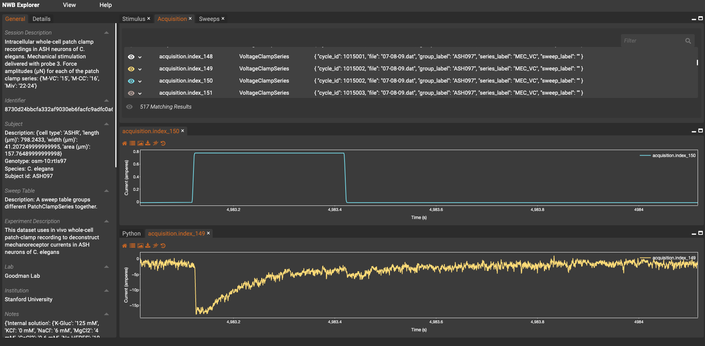
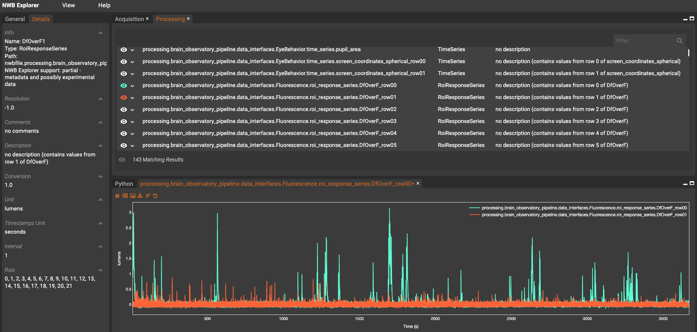

# GSoC_2021_OSB_NWB


---

## Conversion of public neurophysiology datasets to NeuroData Without Borders format

### Student Developer: Steph Prince
### Mentors: Ankur Sinha, Padraig Gleeson
### Organization: INCF

### Description
Neuroscientists have begun to publicly share more and more datasets, however there are still barriers to making these datasets easily reusable by the community. One of these barriers has been the accessibility of shared data; it takes extensive time and effort to understand different data formats and determine which datasets are best suited for the scientific questions being asked. The goal of this project is to convert publicly available datasets to the standardized NeuroData Without Borders (NWB) format so that they can be better interpreted and reused by other researchers. The data will then be made available for interactive analysis and visualization through the NWB explorer on the Open Source Brain repository. By using a standardized data format, researchers can more quickly work with new data and develop analysis methods to apply to a wide variety of datasets. The ability to easily explore and visualize data will also allow researchers to quickly assess the contents of the data and if they can reuse it. Thus, the results of this project will contribute to an important resource for scientists.

### Overview

This repository contains the code, documentation, and example data files for the Google Summer of Code 2021 project. 

* **doc**: contains notes from dataset conversion and visualization testing.
* **images**: contains example NWB Explorer screenshots from test datasets.
* **notebooks**: contains exploratory notebooks for converting and inspecting nwb data files. The `conversion_with_metadata.ipynb` and `inspect_converted_data.ipynwb` notebooks have been updated and incorporated into a single conversion script: `src/goodman_to_nwb_conversion.py`. 
* **src**: contains code for converting the Goodman Lab data from Patchmaster .dat to NWB format.
* **test_data**: contains NWB files and data images generated from the project. Includes converted Goodman Lab data and a pseudo-simulated NWB file for NWB Explorer testing purposes.
 

---

## Conversion of Goodman Lab datasets

### Summary

**Goal:** Convert Goodman Lab data from HEKA Patchmaster format to NWB format

This code uses a metadata spreadsheet and .dat files acquired from the HEKA Patchmaster software to generate NWB files with experimental data.

Example converted data file shown here:



### How to use

The data can be converted by running the following command while in the src directory: 

```python
python goodman_to_nwb_conversion.py
``` 

This `goodman_to_nwb_conversion.py` file can be edited to convert additional datasets, overwrite existing files, or use other metadata spreadsheets (see example below).

```python
    metadata_filename = '..//test_data//ASH-metadata_12_III_29.xls'
    cell_list = ['ASH097', 'ASH116', 'ASH230', 'ASH287']
    overwrite = True

    convert_goodman_to_nwb(metadata_filename, cell_list, overwrite)
```

The x_to_nwb module used to convert .dat files to .nwb format was forked from [byte-physics/x_to_nwb](https://github.com/byte-physics/x-to-nwb) and adapted to be compatible with data acquired from older Patchmaster versions (pre v2x90). This module has also been adapted to support a metadata input that can be used to incorporate additional experiment information when generating the NWB file.

### Commit history

See commits here:
[commits in OpenSourceBrain/GSoC_2021_OSB_NWB](https://github.com/OpenSourceBrain/GSoC_2021_OSB_NWB/commits?author=stephprince)

### Current state of the project

Current outstanding question and remaining to-do items for a fully converted dataset are described in the documentation: [doc/dat_to_nwb_testing.md](doc/dat_to_nwb_testing.md)

---

## Dataset testing and feature development with NWB Explorer

### Summary

**Goal:** Test how existing publicly shared NWB datasets from the DANDI neurophysiology data platform are displayed with the NWB Explorer and work with developers to add enhancements.

Publicly available NWB datasets were visualized on NWB Explorer to test what objects in the files could and could not be visualized at the time. The following fixes/features were developed based on this testing:

* add experimenter/related publication metadata that was missing for some files
* add text display for values stored in units/trials/electrodes tables
* add processing tab for data stored in processing module
* add support for plotting two-dimensional time series

Example of processing tab and two-dimensional time series plot features shown here:



### Commit history

See commits merged into the NWB Explorer development branch here: [commits in Metacell/nwb-explorer](https://github.com/MetaCell/nwb-explorer/commits/development?author=stephprince)

See submitted issues and pull requests here: [issues/pull requests in MetaCell/nwb-explorer](https://github.com/MetaCell/nwb-explorer/issues?q=author%3Astephprince)


### Current state of the project

Notes on the dataset testing and links to example files can be found in [doc/nwbe_dataset_testing.md](doc/nwbe_dataset_testing.md). Any remaining enhancements/issues/features found when testing the NWB Explorer with example datasets have been submitted as issues to [Metacell/nwb-explorer](https://github.com/MetaCell/nwb-explorer/issues).

A pseudo-simulated dataset was generated from existing dandi files with the [generate_test_nwb.ipynb](notebooks/generate_test_nwb.ipynb) notebook to test plotting functionality on the NWB Explorer. This file could also be used for futher testing purposes.